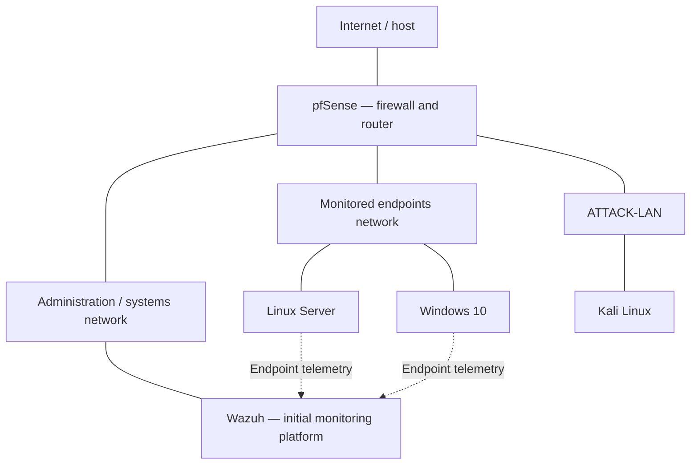

# SOC-LAB

**A virtual environment for Security Operations and Blue Team practice.**

This lab models a small segmented enterprise environment: pfSense controls communication between networks, Windows and Linux provide endpoint telemetry, Kali is dedicated to controlled adversary simulation, and a central monitoring platform brings the events together.

The aim is to connect an action with its defensive visibility: **activity → events → collection → detection → analysis → investigation → response**.

## Architecture



The diagram shows logical zones and the initial telemetry flow. Connections represent network relationships, not unrestricted firewall access.

| Virtual machine | Role |
| :--- | :--- |
| **pfSense** | Routing, network segmentation and firewall controls |
| **Wazuh** | Initial central security monitoring platform |
| **Linux Server** | Monitored server and source of system/authentication events |
| **Windows 10** | Monitored endpoint and source of Windows security events |
| **Kali Linux** | Controlled adversary simulation on a separate network |

## Current state

- Five VMs installed in VirtualBox.
- Three logical networks: administration/systems, monitored endpoints and ATTACK-LAN.
- pfSense established as the firewall/router.
- Initial Wazuh deployment and endpoint agent configuration.
- Practical setup work involving DHCP, addressing, inter-network communication, firewall rules and agent connectivity.

**Telemetry validation and investigation exercises remain the next stage.** The repository documents the infrastructure already described; no completed incident investigations are claimed.

## Monitoring platform evolution

The initial architecture uses **Wazuh**. A transition to **OpenObserve** is planned because of hardware constraints, while retaining pfSense, Windows, Linux, Kali and the network separation.

The preferred OpenObserve deployment is a native Linux installation managed by **systemd**. The migration is planned, rather than recorded as completed.

The professional focus remains the same across platforms: understanding event sources, interpreting logs and relating activity to the telemetry it produces.

## Repository structure

```text
SOC-LAB/
├── README.md
├── docs/
│   └── architecture.md
├── infrastructure/
├── endpoints/
├── monitoring/
├── simulation/
└── evidence/
```

| Directory | Purpose |
| :--- | :--- |
| `docs/` | Architecture, component roles and the project state |
| `infrastructure/` | Actual VirtualBox, network and pfSense project files |
| `endpoints/` | Actual Linux and Windows endpoint configuration files |
| `monitoring/` | Actual monitoring platform and collection configuration files |
| `simulation/` | Material from controlled activities performed in the lab |
| `evidence/` | Actual reviewed logs, exports and screenshots from the lab |

Directories without project files are kept with `.gitkeep`. They contain no invented configurations, incidents or results.

[Architecture and component roles](docs/architecture.md) · [Kelson Pedro](https://github.com/Kelson-D-Pedro) · [LinkedIn](https://www.linkedin.com/in/kelsonpedro/)
