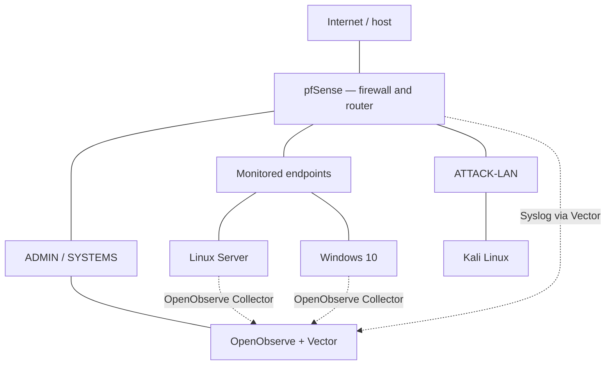

# SOC-LAB

**A segmented virtual environment for Security Operations and Blue Team practice.**

This lab models a small enterprise network: pfSense controls communication between zones, Windows and Linux provide endpoint telemetry, Kali supports controlled adversary simulation, and OpenObserve is the selected platform for central log analysis.

The aim is to follow the complete defensive workflow: **activity → events → collection → detection → alert → investigation → response**.

## Updated architecture



This diagram represents the redesigned architecture and intended collection paths. Network connections do not imply unrestricted firewall access. OpenObserve belongs to ADMIN/SYSTEMS, separate from ATTACK-LAN.

| Component | Role |
| :--- | :--- |
| **VirtualBox** | Virtualization platform |
| **pfSense** | Routing, segmentation, firewall controls and network logs |
| **OpenObserve** | Central log search, dashboards, detections and alerts |
| **OpenObserve Collector** | Planned Windows and Linux telemetry collection |
| **Vector** | Planned pfSense Syslog ingestion on the OpenObserve VM |
| **Windows 10 / Linux Server** | Monitored endpoint and server |
| **Kali Linux** | Controlled adversary simulation |

## Project status

The original infrastructure and initial Wazuh configuration were established. Hardware limitations prompted a redesign of the monitoring layer around OpenObserve.

**The updated architecture is defined.** Native Linux installation, automatic service startup, collection paths and end-to-end telemetry validation are the next implementation steps described in the project information. Completed OpenObserve deployment, detection rules and incident investigations are not yet documented.

## Why the monitoring layer changed

The host has approximately **9.6 GB of usable RAM**. Running the original Wazuh Manager, Indexer and Dashboard alongside the other VMs placed too much pressure on available memory.

OpenObserve was selected to adapt the monitoring layer to these constraints. The intended focus is log collection, search, detections, alerts and investigation. This is an architecture trade-off: integrated Wazuh capabilities such as file integrity monitoring, vulnerability detection and Security Configuration Assessment are outside the replacement scope.

OpenObserve and Vector are planned as native Linux services, **`openobserve.service`** and **`vector.service`**, managed by **systemd**, without Docker.

## Telemetry and detection work

| Source | Planned collection path | Areas of analysis |
| :--- | :--- | :--- |
| Windows | Windows Event Logs → OpenObserve Collector → OpenObserve | Authentication, account creation, privileges and system activity |
| Linux | Authentication / system logs → OpenObserve Collector → OpenObserve | SSH, sudo, administrative activity and services |
| pfSense | Syslog → Vector → OpenObserve | Firewall events and traffic between network zones |

Planned detection work includes repeated authentication failures, successful login after failures, new accounts, privileged logins, SSH and sudo activity, and suspicious network traffic. Queries, thresholds and time windows will form the basis of these detections; MITRE ATT&CK mapping is a later step.

These are project objectives, rather than published investigation results.

## Resource plan

| Virtual machine | Planned RAM |
| :--- | ---: |
| pfSense | 1 GB |
| OpenObserve | 1.5 GB |
| Linux Server | 1 GB |
| Windows 10 | 2.5 GB |
| Kali Linux | 1.25 GB |
| **Total VMs** | **7.25 GB** |

This allocation leaves approximately **2.35 GB** for the host. It is a proposed budget, not a measured performance result. VMs can be powered on according to the exercise: Windows can remain off during a Linux exercise, Linux during a Windows exercise, and Kali during investigation.

## Repository structure

```text
SOC-LAB/
├── README.md
├── docs/
│   └── architecture.md
├── infrastructure/
├── endpoints/
├── monitoring/
├── simulation/
└── evidence/
```

| Directory | Purpose |
| :--- | :--- |
| `docs/` | Architecture, component roles and design decisions |
| `infrastructure/` | VirtualBox, network and pfSense project files |
| `endpoints/` | Linux and Windows endpoint configuration files |
| `monitoring/` | OpenObserve, collector, Vector and service configuration files |
| `simulation/` | Material from controlled activities performed in the lab |
| `evidence/` | Reviewed logs, exports and screenshots from the lab |

Directories awaiting actual project files are kept with `.gitkeep`.

[Architecture and collection paths](docs/architecture.md) · [Kelson Pedro](https://github.com/Kelson-D-Pedro) · [LinkedIn](https://www.linkedin.com/in/kelsonpedro/)
