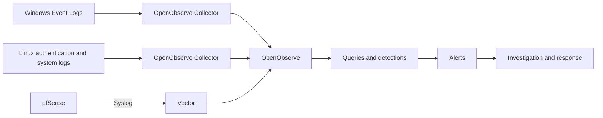

# Architecture and collection paths

## Purpose and evolution

SOC-LAB connects controlled activity with network and endpoint telemetry in a segmented virtual environment. Its intended workflow runs from event generation through collection, detection, alert triage, investigation and response.

The initial monitoring stack used Wazuh Manager, Indexer, Dashboard and endpoint agents. With approximately **9.6 GB of usable host RAM**, memory pressure limited simultaneous VM operation. The monitoring architecture was therefore redesigned around **OpenObserve**, retaining pfSense, Windows, Linux, Kali and the three network zones.

This document describes the updated design. Deployment and validation steps expressed as future work in the supplied project information remain implementation tasks.

## Logical zones

| Zone | Components | Purpose |
| :--- | :--- | :--- |
| **ADMIN/SYSTEMS** | OpenObserve VM, including Vector | Central monitoring and log ingestion |
| **Monitored endpoints** | Linux Server and Windows 10 | Systems producing endpoint telemetry |
| **ATTACK-LAN** | Kali Linux | Controlled adversary simulation |

pfSense routes between the zones and controls communication through firewall rules. The monitoring platform is separate from ATTACK-LAN. Exact addressing, interface mappings and firewall rules are not specified in the supplied architecture.

The arrows describe intended telemetry paths, rather than a verified operational pipeline.

## OpenObserve VM

The selected deployment approach is a minimal Linux distribution with a native installation and **no Docker**.

Two services are planned on this VM:

- `openobserve.service` — central log storage, search, dashboards and alerting platform.
- `vector.service` — receives pfSense Syslog and forwards it to OpenObserve.

Both are intended to start automatically through systemd when the VM starts. Service definitions and ingestion configuration will be documented when implemented.

## Windows telemetry

The planned collector sources are Windows Security, System and Application event logs. Authentication, account creation and privileged activity are the initial areas of interest.

The supplied architecture identifies the following event IDs for investigation:

| Event ID | Event |
| :--- | :--- |
| 4624 | Successful logon |
| 4625 | Failed logon |
| 4672 | Special privileges assigned to a new logon |
| 4720 | User account created |

Process telemetry depends on the audit settings and sources enabled on the endpoint; it is not assumed to be available solely because a collector is installed.

## Linux telemetry

Planned sources include `/var/log/auth.log`, `/var/log/syslog` and journald, depending on the distribution and logging configuration. Areas of interest include SSH authentication, sudo, root login, administrative changes and services.

The intended path is **Linux logs → OpenObserve Collector → OpenObserve**. Availability of command and process activity will depend on the configured telemetry sources.

## pfSense telemetry

pfSense retains its routing, firewall and segmentation roles. Its network events are intended to travel through **pfSense → Syslog → Vector → OpenObserve**. Vector runs on the same VM as OpenObserve; no additional VM is introduced.

Port-scan and suspicious ATTACK-LAN detections are planned analysis objectives. Their effectiveness will depend on the firewall events collected and the implemented detection logic.

## Detection approach

The new design separates collection from detection logic. Planned detections will use queries, filters, thresholds and time windows rather than relying on the initial Wazuh rule library.

The supplied design proposes an example threshold of **five or more failed authentications from the same IP in five minutes**. This is an initial detection idea, not a tested rule or an investigation result.

| Source | Planned detection areas |
| :--- | :--- |
| Windows | Failed logon, repeated failures, successful login after failures, new accounts and privileged logins |
| Linux | SSH failures, repeated SSH failures and sudo activity |
| pfSense | Port scanning and suspicious ATTACK-LAN traffic |

MITRE ATT&CK mapping is planned after the detections and collected evidence can support it.

## Resource budget

| VM | Planned RAM |
| :--- | ---: |
| pfSense | 1 GB |
| OpenObserve | 1.5 GB |
| Linux Server | 1 GB |
| Windows 10 | 2.5 GB |
| Kali Linux | 1.25 GB |
| **Total** | **7.25 GB** |

The plan leaves approximately **2.35 GB** of the stated usable RAM for the host. These are intended allocations; no measured resource consumption or performance improvement is recorded.

VM operation can follow the task: keep Windows off for a Linux exercise, Linux off for a Windows exercise, and Kali off during investigation.

## Scope and next implementation steps

OpenObserve is selected for log analysis, dashboards, detections and alerts. The redesign does not attempt to recreate all integrated Wazuh functions, including file integrity monitoring, vulnerability detection, Security Configuration Assessment and agent-specific capabilities.

The next steps described in the architecture are native OpenObserve deployment, Vector and endpoint collection, service startup and telemetry validation. Detection engineering, controlled simulation, alert triage and investigation follow the working pipeline.

Actual configuration files and evidence will be added as this work is completed. No completed incident case is claimed here.

[Back to SOC-LAB](../README.md)
